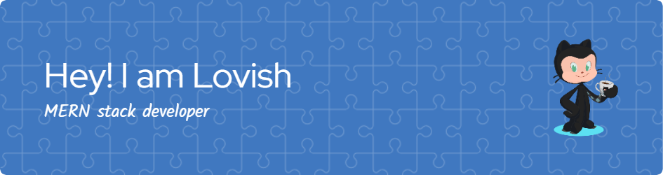

 <h1 >Hello there! I am Lovish, a Full-Stack Engineer.</h1> 
 

# 💫 About Me:
🔭 I’m currently working on Interview Prep 🤝 I’m looking to collaborate on open-source projects 🌱 I’m currently learning how things work under the hood 💬 Ask me about JavaScript, React, Node, MongoDB 

# 💻 Tech Stack:
                   

# 🎯 Projects: ⬇️
